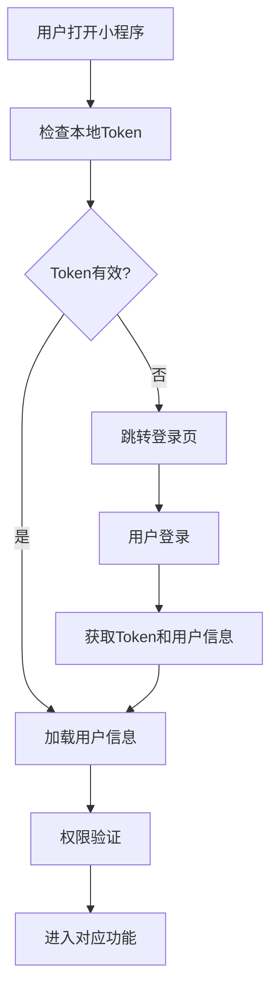
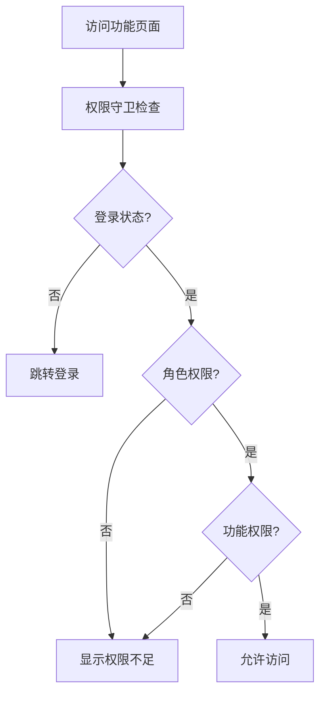

# 电力渠道销售平台小程序业务功能实现总结

## 1. 认证与权限系统

### 1.1 角色定义
```javascript
const ROLES = {
  CUSTOMER: 'CUSTOMER',                    // 普通客户
  CUSTOMER_MANAGER: 'CUSTOMER_MANAGER',    // 客户经理
  SALES_MANAGER: 'SALES_MANAGER',          // 销售经理
  SALES_DIRECTOR: 'SALES_DIRECTOR',        // 销售总监
  CUSTOMER_SERVICE: 'CUSTOMER_SERVICE',    // 客服人员
  FINANCE: 'FINANCE',                      // 财务人员
  ADMIN: 'ADMIN'                           // 系统管理员
}
```

### 1.2 权限定义
- **客户管理权限**: customer:view, customer:create, customer:update, customer:delete
- **订单管理权限**: order:view, order:create, order:update, order:cancel, order:approve
- **跟进管理权限**: follow:view, follow:create, follow:update, follow:delete
- **业绩查看权限**: performance:view, performance:team
- **产品管理权限**: product:view, product:price
- **合同管理权限**: contract:view, contract:sign

### 1.3 角色权限映射
- **普通客户**: 产品查看、订单管理、合同查看
- **客户经理**: 客户管理、跟进管理、业绩查看、产品查看
- **销售经理**: 团队管理、订单审批、业绩统计、合同签署

## 2. 客户经理功能模块

### 2.1 工作台首页 (`/pages/manager/index/index`)
**功能特性**:
- ✅ 今日数据统计（新增客户、跟进任务、新订单、订单金额）
- ✅ 月度数据统计（新增客户、总订单、订单金额、目标进度）
- ✅ 整体统计数据（总客户、活跃客户、完成订单、满意度）
- ✅ 快捷操作入口（客户管理、跟进任务、业绩统计、订单管理）
- ✅ 最近客户列表
- ✅ 紧急任务列表
- ✅ 权限控制和登录检查

**API接口**:
- `GET /manager/workbench` - 获取工作台数据
- `GET /manager/recent-customers` - 获取最近客户
- `GET /manager/urgent-tasks` - 获取紧急任务

### 2.2 客户管理 (`/pages/manager/customers/customers`)
**功能特性**:
- ✅ 客户列表展示（分页加载）
- ✅ 多标签筛选（全部、待审核、正常、暂停）
- ✅ 搜索功能（姓名、公司、电话）
- ✅ 高级筛选（行业、规模）
- ✅ 排序功能（创建时间、联系时间等）
- ✅ 客户状态管理（8种状态）
- ✅ 快捷操作（拨打电话、微信联系、快速跟进）
- ✅ 批量操作支持
- ✅ 数据导出功能
- ✅ 权限控制（查看、创建、修改、删除）

**API接口**:
- `GET /manager/customers` - 获取客户列表
- `GET /manager/customers/statistics` - 获取客户统计
- `PUT /manager/customers/{id}/status` - 修改客户状态
- `DELETE /manager/customers/{id}` - 删除客户
- `POST /manager/customers/contact-record` - 记录联系记录
- `GET /manager/customers/export` - 导出客户数据

### 2.3 跟进管理 (`/pages/manager/follow/follow`)
**功能特性**:
- ✅ 跟进任务分类（待跟进、已跟进、预约跟进、逾期未跟进）
- ✅ 跟进方式支持（电话、拜访、邮件、微信、会议）
- ✅ 优先级管理（高、中、低）
- ✅ 跟进记录创建和编辑
- ✅ 任务提醒功能
- ✅ 客户选择和关联
- ✅ 日期时间选择器
- ✅ 跟进统计数据
- ✅ 权限控制

**API接口**:
- `GET /manager/follow/statistics` - 获取跟进统计
- `GET /manager/follow/list` - 获取跟进列表
- `POST /manager/follow` - 创建跟进记录
- `PUT /manager/follow/{id}` - 更新跟进记录
- `DELETE /manager/follow/{id}` - 删除跟进记录

### 2.4 业绩统计 (`/pages/manager/performance/performance`)
**功能特性**:
- ✅ 个人业绩概览
- ✅ 月度趋势分析
- ✅ 客户分布统计
- ✅ 订单分析
- ✅ 跟进效率统计
- ✅ 排行榜功能
- ✅ 时间筛选（月、季度、年）
- ✅ 图表展示
- ✅ 数据分享功能

**API接口**:
- `GET /manager/performance/overview` - 获取业绩概览
- `GET /manager/performance/trend` - 获取趋势数据
- `GET /manager/performance/distribution` - 获取分布数据
- `GET /manager/performance/ranking` - 获取排行榜

## 3. 普通客户功能模块

### 3.1 产品浏览 (`/pages/products/list/list`)
**功能特性**:
- ✅ 产品分类展示（工商业、居民、农业、临时用电）
- ✅ 产品列表（分页加载）
- ✅ 搜索功能
- ✅ 分类筛选
- ✅ 产品详情跳转
- ✅ 电费计算器入口
- ✅ 权限控制

**API接口**:
- `GET /products` - 获取产品列表
- `GET /products/hot` - 获取热门产品

### 3.2 订单管理 (`/pages/orders/index/index`)
**功能特性**:
- ✅ 订单状态管理（7种状态）
- ✅ 订单列表展示
- ✅ 订单详情查看
- ✅ 订单操作（取消、支付、查看合同）
- ✅ 搜索和筛选
- ✅ 订单统计
- ✅ 服务跟踪
- ✅ 权限控制

**API接口**:
- `GET /orders/stats` - 获取订单统计
- `GET /user/orders` - 获取用户订单
- `PUT /orders/{id}/cancel` - 取消订单
- `POST /orders/{id}/pay` - 订单支付

### 3.3 合同查看 (`/pages/profile/contracts/contracts`)
**功能特性**:
- ✅ 合同列表展示
- ✅ 合同详情查看
- ✅ 合同下载功能
- ✅ 续约提醒
- ✅ 权限控制

## 4. 通用功能组件

### 4.1 权限守卫组件 (`/components/role-guard/index`)
**功能特性**:
- ✅ 角色权限检查
- ✅ 功能权限验证
- ✅ 登录状态检查
- ✅ 无权限处理
- ✅ 加载状态展示
- ✅ 权限验证完成事件

**使用方式**:
```xml
<role-guard roles="{{['CUSTOMER_MANAGER']}}" permissions="{{['customer:view']}}">
  <view>需要权限保护的内容</view>
</role-guard>
```

### 4.2 认证工具类 (`/utils/auth.js`)
**功能特性**:
- ✅ 用户信息管理
- ✅ Token管理
- ✅ 登录状态检查
- ✅ 权限验证
- ✅ 角色判断
- ✅ 装饰器支持

**主要方法**:
```javascript
// 基础认证
auth.isLoggedIn()           // 检查登录状态
auth.checkLogin()           // 检查并处理登录
auth.login(data)            // 执行登录
auth.logout()               // 退出登录

// 权限检查
auth.hasPermission(perm)    // 检查权限
auth.isCustomerManager()    // 是否客户经理
auth.isCustomer()           // 是否普通客户

// 用户信息
auth.getUserInfo()          // 获取用户信息
auth.getUserRole()          // 获取用户角色
auth.getUserName()          // 获取用户姓名
```

## 5. 数据流转架构

### 5.1 认证流程


### 5.2 权限控制流程


### 5.3 数据加载策略
- **优先级**: 真实API > 模拟数据 > 缓存数据
- **容错机制**: API失败时自动降级到模拟数据
- **离线支持**: 关键数据本地缓存
- **实时同步**: 重要状态变更实时更新

## 6. 技术特性

### 6.1 性能优化
- ✅ 分页加载减少内存占用
- ✅ 图片懒加载
- ✅ 防抖搜索
- ✅ 组件复用
- ✅ 数据缓存

### 6.2 用户体验
- ✅ 加载状态提示
- ✅ 错误处理和重试
- ✅ 空状态展示
- ✅ 下拉刷新
- ✅ 触底加载更多

### 6.3 安全性
- ✅ Token自动过期处理
- ✅ 权限细粒度控制
- ✅ 敏感操作二次确认
- ✅ 数据传输加密

## 7. 部署和配置

### 7.1 环境配置
```javascript
// utils/config.js
module.exports = {
  apiConfig: {
    baseURL: 'https://your-api-domain.com/api/v1',
    timeout: 10000
  }
}
```

### 7.2 权限配置
所有权限在 `utils/auth.js` 中统一管理，支持动态权限分配。

### 7.3 API接口
与后端Spring Boot项目完全对接，支持：
- JWT认证
- RESTful API
- 分页查询
- 文件上传下载
- 实时数据推送

## 8. 后续扩展

### 8.1 待开发功能
- [ ] 实时消息推送
- [ ] 地图定位功能
- [ ] 语音通话集成
- [ ] 数据可视化图表
- [ ] 离线数据同步

### 8.2 优化方向
- [ ] 性能监控
- [ ] 错误日志收集
- [ ] 用户行为分析
- [ ] A/B测试支持

这个小程序实现了完整的电力渠道销售业务流程，包含了客户经理和普通客户的所有核心功能，具有完善的权限控制和良好的用户体验。 